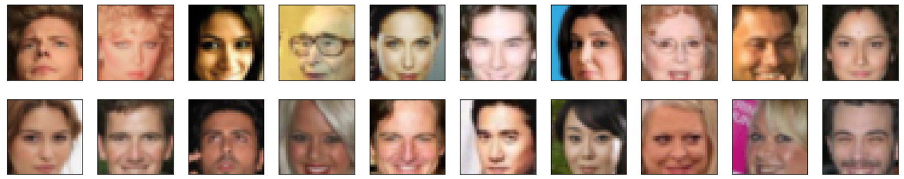
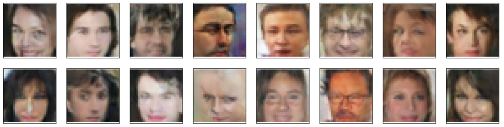

## Face Generation

This repository contains my solution for Udacity's fourth Deep Learning Nanodegree project. 
This project generates new images of faces that look as realistic as possible using a Deep Convolutional Generative Adversarial Network (DCGAN). To train the adversarial network, we are going to use the [CelebFaces Attributes Dataset (CelebA)](http://mmlab.ie.cuhk.edu.hk/projects/CelebA.html), as it would take too much time to create a dataset of images of faces with the same characteristics. However, the disadvantage is that these images are of poor quality and are not diverse enough to cover all types of people.

This is sample data from the dataset that trains the DCGAN:

Here are the results of the network after training for 20 epochs:

# Things that could be improved
* Create a deeper model and use larger size of images, in order to see them clearly
* Use a larger trainset with more diversity of faces
* Train with more epochs (e.g. 1000)

